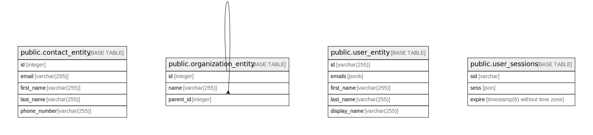

# grassroots_test

## Tables

| Name | Columns | Comment | Type |
| ---- | ------- | ------- | ---- |
| [public.contact_entity](public.contact_entity.md) | 5 |  | BASE TABLE |
| [public.organization_entity](public.organization_entity.md) | 3 |  | BASE TABLE |
| [public.user_entity](public.user_entity.md) | 5 |  | BASE TABLE |
| [public.user_sessions](public.user_sessions.md) | 3 |  | BASE TABLE |

## Relations

---

> Generated by [tbls](https://github.com/k1LoW/tbls)
