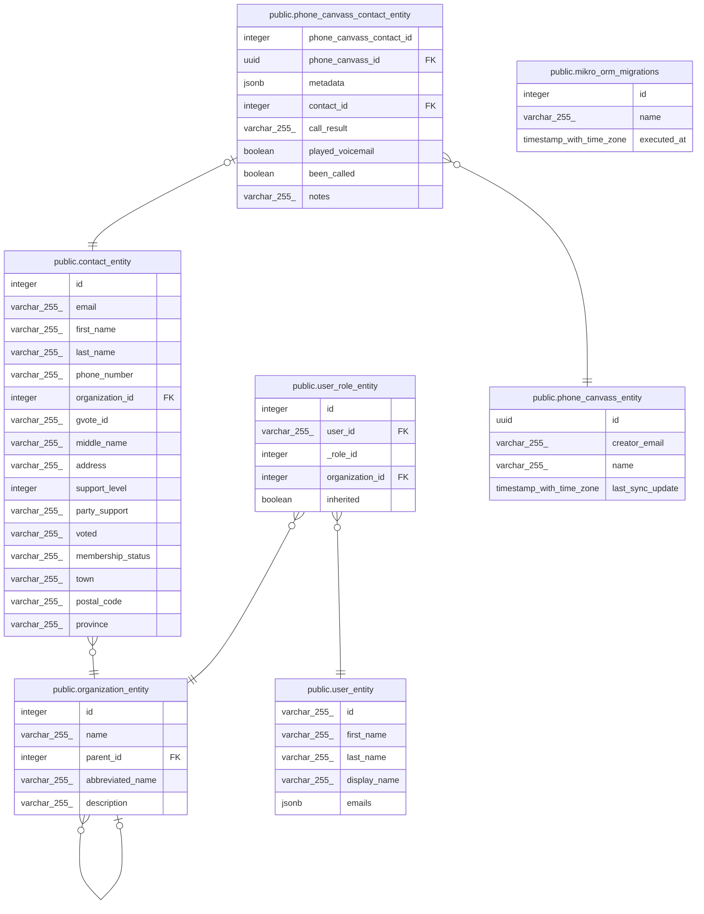

# grassroots_test

## Tables

| Name                                                                          | Columns | Comment | Type       |
| ----------------------------------------------------------------------------- | ------- | ------- | ---------- |
| [public.mikro_orm_migrations](public.mikro_orm_migrations.md)                 | 3       |         | BASE TABLE |
| [public.user_entity](public.user_entity.md)                                   | 5       |         | BASE TABLE |
| [public.organization_entity](public.organization_entity.md)                   | 5       |         | BASE TABLE |
| [public.contact_entity](public.contact_entity.md)                             | 16      |         | BASE TABLE |
| [public.user_role_entity](public.user_role_entity.md)                         | 5       |         | BASE TABLE |
| [public.phone_canvass_entity](public.phone_canvass_entity.md)                 | 4       |         | BASE TABLE |
| [public.phone_canvass_contact_entity](public.phone_canvass_contact_entity.md) | 8       |         | BASE TABLE |

## Relations

---

> Generated by [tbls](https://github.com/k1LoW/tbls)
