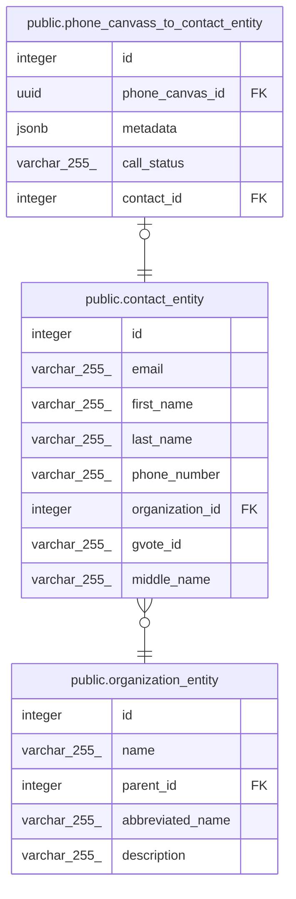

# public.contact_entity

## Description

## Columns

| Name            | Type         | Default                                    | Nullable | Children                                                                            | Parents                                                     | Comment |
| --------------- | ------------ | ------------------------------------------ | -------- | ----------------------------------------------------------------------------------- | ----------------------------------------------------------- | ------- |
| id              | integer      | nextval('contact_entity_id_seq'::regclass) | false    | [public.phone_canvass_to_contact_entity](public.phone_canvass_to_contact_entity.md) |                                                             |         |
| email           | varchar(255) |                                            | false    |                                                                                     |                                                             |         |
| first_name      | varchar(255) |                                            | false    |                                                                                     |                                                             |         |
| last_name       | varchar(255) |                                            | false    |                                                                                     |                                                             |         |
| phone_number    | varchar(255) |                                            | false    |                                                                                     |                                                             |         |
| organization_id | integer      |                                            | false    |                                                                                     | [public.organization_entity](public.organization_entity.md) |         |
| gvote_id        | varchar(255) |                                            | true     |                                                                                     |                                                             |         |
| middle_name     | varchar(255) |                                            | true     |                                                                                     |                                                             |         |

## Constraints

| Name                                    | Type        | Definition                                                                         |
| --------------------------------------- | ----------- | ---------------------------------------------------------------------------------- |
| contact_entity_email_not_null           | n           | NOT NULL email                                                                     |
| contact_entity_first_name_not_null      | n           | NOT NULL first_name                                                                |
| contact_entity_id_not_null              | n           | NOT NULL id                                                                        |
| contact_entity_last_name_not_null       | n           | NOT NULL last_name                                                                 |
| contact_entity_organization_id_not_null | n           | NOT NULL organization_id                                                           |
| contact_entity_phone_number_not_null    | n           | NOT NULL phone_number                                                              |
| contact_entity_organization_id_foreign  | FOREIGN KEY | FOREIGN KEY (organization_id) REFERENCES organization_entity(id) ON UPDATE CASCADE |
| contact_entity_pkey                     | PRIMARY KEY | PRIMARY KEY (id)                                                                   |
| contact_entity_email_unique             | UNIQUE      | UNIQUE (email)                                                                     |
| contact_entity_gvote_id_unique          | UNIQUE      | UNIQUE (gvote_id)                                                                  |

## Indexes

| Name                           | Definition                                                                                         |
| ------------------------------ | -------------------------------------------------------------------------------------------------- |
| contact_entity_pkey            | CREATE UNIQUE INDEX contact_entity_pkey ON public.contact_entity USING btree (id)                  |
| contact_entity_email_unique    | CREATE UNIQUE INDEX contact_entity_email_unique ON public.contact_entity USING btree (email)       |
| contact_entity_gvote_id_unique | CREATE UNIQUE INDEX contact_entity_gvote_id_unique ON public.contact_entity USING btree (gvote_id) |

## Relations

---

> Generated by [tbls](https://github.com/k1LoW/tbls)
