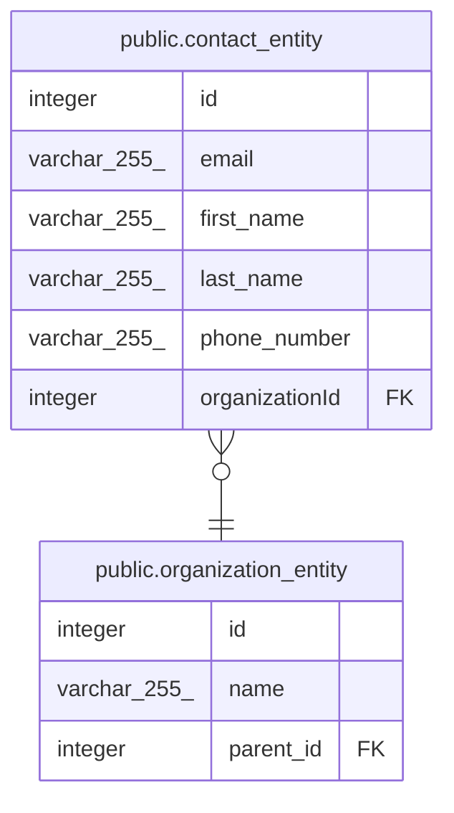

# public.contact_entity

## Description

## Columns

| Name           | Type         | Default                                    | Nullable | Children | Parents                                                     | Comment |
| -------------- | ------------ | ------------------------------------------ | -------- | -------- | ----------------------------------------------------------- | ------- |
| id             | integer      | nextval('contact_entity_id_seq'::regclass) | false    |          |                                                             |         |
| email          | varchar(255) |                                            | false    |          |                                                             |         |
| first_name     | varchar(255) |                                            | false    |          |                                                             |         |
| last_name      | varchar(255) |                                            | false    |          |                                                             |         |
| phone_number   | varchar(255) |                                            | false    |          |                                                             |         |
| organizationId | integer      |                                            | false    |          | [public.organization_entity](public.organization_entity.md) |         |

## Constraints

| Name                                  | Type        | Definition                                                                          |
| ------------------------------------- | ----------- | ----------------------------------------------------------------------------------- |
| contact_entity_organizationId_foreign | FOREIGN KEY | FOREIGN KEY ("organizationId") REFERENCES organization_entity(id) ON UPDATE CASCADE |
| contact_entity_pkey                   | PRIMARY KEY | PRIMARY KEY (id)                                                                    |
| contact_entity_email_unique           | UNIQUE      | UNIQUE (email)                                                                      |

## Indexes

| Name                        | Definition                                                                                   |
| --------------------------- | -------------------------------------------------------------------------------------------- |
| contact_entity_pkey         | CREATE UNIQUE INDEX contact_entity_pkey ON public.contact_entity USING btree (id)            |
| contact_entity_email_unique | CREATE UNIQUE INDEX contact_entity_email_unique ON public.contact_entity USING btree (email) |

## Relations

---

> Generated by [tbls](https://github.com/k1LoW/tbls)
