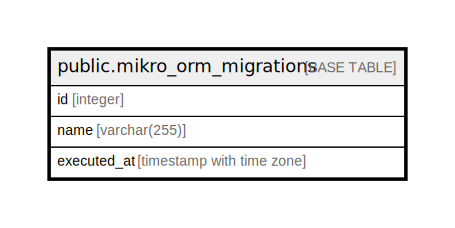

# public.mikro_orm_migrations

## Description

## Columns

| Name        | Type                     | Default                                          | Nullable | Children | Parents | Comment |
| ----------- | ------------------------ | ------------------------------------------------ | -------- | -------- | ------- | ------- |
| id          | integer                  | nextval('mikro_orm_migrations_id_seq'::regclass) | false    |          |         |         |
| name        | varchar(255)             |                                                  | true     |          |         |         |
| executed_at | timestamp with time zone | CURRENT_TIMESTAMP                                | true     |          |         |         |

## Constraints

| Name                      | Type        | Definition       |
| ------------------------- | ----------- | ---------------- |
| mikro_orm_migrations_pkey | PRIMARY KEY | PRIMARY KEY (id) |

## Indexes

| Name                      | Definition                                                                                    |
| ------------------------- | --------------------------------------------------------------------------------------------- |
| mikro_orm_migrations_pkey | CREATE UNIQUE INDEX mikro_orm_migrations_pkey ON public.mikro_orm_migrations USING btree (id) |

## Relations

---

> Generated by [tbls](https://github.com/k1LoW/tbls)
