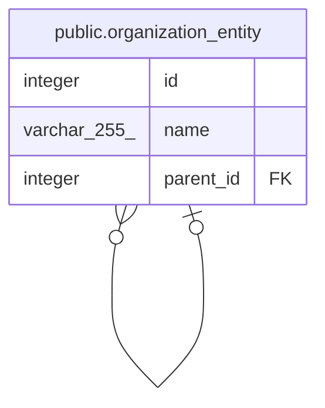

# public.organization_entity

## Description

## Columns

| Name      | Type         | Default                                         | Nullable | Children                                                    | Parents                                                     | Comment |
| --------- | ------------ | ----------------------------------------------- | -------- | ----------------------------------------------------------- | ----------------------------------------------------------- | ------- |
| id        | integer      | nextval('organization_entity_id_seq'::regclass) | false    | [public.organization_entity](public.organization_entity.md) |                                                             |         |
| name      | varchar(255) |                                                 | false    |                                                             |                                                             |         |
| parent_id | integer      |                                                 | true     |                                                             | [public.organization_entity](public.organization_entity.md) |         |

## Constraints

| Name                                  | Type        | Definition                                                                                      |
| ------------------------------------- | ----------- | ----------------------------------------------------------------------------------------------- |
| organization_entity_parent_id_foreign | FOREIGN KEY | FOREIGN KEY (parent_id) REFERENCES organization_entity(id) ON UPDATE CASCADE ON DELETE SET NULL |
| organization_entity_pkey              | PRIMARY KEY | PRIMARY KEY (id)                                                                                |

## Indexes

| Name                     | Definition                                                                                  |
| ------------------------ | ------------------------------------------------------------------------------------------- |
| organization_entity_pkey | CREATE UNIQUE INDEX organization_entity_pkey ON public.organization_entity USING btree (id) |

## Relations

---

> Generated by [tbls](https://github.com/k1LoW/tbls)
