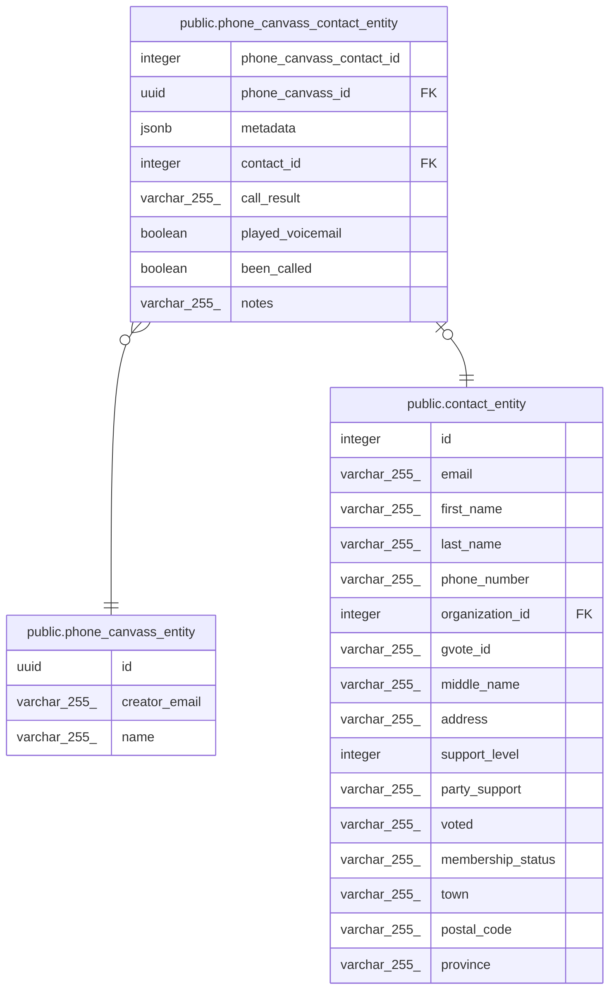

# public.phone_canvass_contact_entity

## Description

## Columns

| Name                     | Type         | Default                                                  | Nullable | Children | Parents                                                       | Comment |
| ------------------------ | ------------ | -------------------------------------------------------- | -------- | -------- | ------------------------------------------------------------- | ------- |
| phone_canvass_contact_id | integer      | nextval('phone_canvass_contact_entity_id_seq'::regclass) | false    |          |                                                               |         |
| phone_canvass_id         | uuid         |                                                          | false    |          | [public.phone_canvass_entity](public.phone_canvass_entity.md) |         |
| metadata                 | jsonb        |                                                          | false    |          |                                                               |         |
| contact_id               | integer      |                                                          | false    |          | [public.contact_entity](public.contact_entity.md)             |         |
| call_result              | varchar(255) |                                                          | true     |          |                                                               |         |
| played_voicemail         | boolean      | false                                                    | false    |          |                                                               |         |
| been_called              | boolean      |                                                          | false    |          |                                                               |         |
| notes                    | varchar(255) |                                                          | false    |          |                                                               |         |

## Constraints

| Name                                                   | Type        | Definition                                                                           |
| ------------------------------------------------------ | ----------- | ------------------------------------------------------------------------------------ |
| phone_canvass_contact_entity_been_called_not_null      | n           | NOT NULL been_called                                                                 |
| phone_canvass_contact_entity_contact_id_not_null       | n           | NOT NULL contact_id                                                                  |
| phone_canvass_contact_entity_id_not_null               | n           | NOT NULL phone_canvass_contact_id                                                    |
| phone_canvass_contact_entity_metadata_not_null         | n           | NOT NULL metadata                                                                    |
| phone_canvass_contact_entity_notes_not_null            | n           | NOT NULL notes                                                                       |
| phone_canvass_contact_entity_phone_canvas_id_not_null  | n           | NOT NULL phone_canvass_id                                                            |
| phone_canvass_contact_entity_played_voicemail_not_null | n           | NOT NULL played_voicemail                                                            |
| phone_canvass_contact_entity_contact_id_foreign        | FOREIGN KEY | FOREIGN KEY (contact_id) REFERENCES contact_entity(id) ON UPDATE CASCADE             |
| phone_canvass_contact_entity_phone_canvass_id_foreign  | FOREIGN KEY | FOREIGN KEY (phone_canvass_id) REFERENCES phone_canvass_entity(id) ON UPDATE CASCADE |
| phone_canvass_contact_entity_pkey                      | PRIMARY KEY | PRIMARY KEY (phone_canvass_contact_id)                                               |
| phone_canvass_contact_entity_contact_id_unique         | UNIQUE      | UNIQUE (contact_id)                                                                  |

## Indexes

| Name                                           | Definition                                                                                                                          |
| ---------------------------------------------- | ----------------------------------------------------------------------------------------------------------------------------------- |
| phone_canvass_contact_entity_pkey              | CREATE UNIQUE INDEX phone_canvass_contact_entity_pkey ON public.phone_canvass_contact_entity USING btree (phone_canvass_contact_id) |
| phone_canvass_contact_entity_contact_id_unique | CREATE UNIQUE INDEX phone_canvass_contact_entity_contact_id_unique ON public.phone_canvass_contact_entity USING btree (contact_id)  |

## Relations

---

> Generated by [tbls](https://github.com/k1LoW/tbls)
