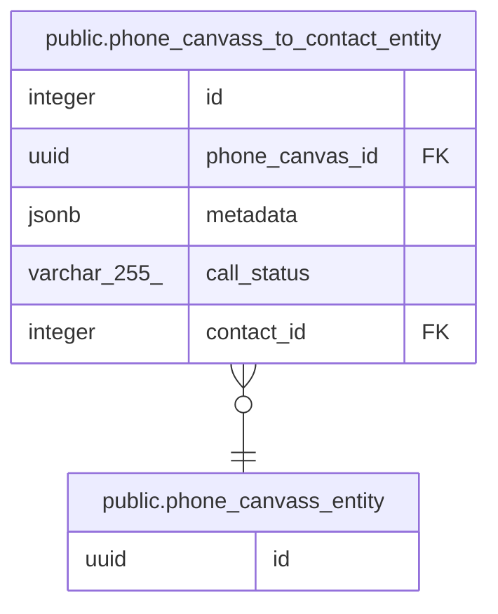

# public.phone_canvass_entity

## Description

## Columns

| Name | Type | Default           | Nullable | Children                                                                            | Parents | Comment |
| ---- | ---- | ----------------- | -------- | ----------------------------------------------------------------------------------- | ------- | ------- |
| id   | uuid | gen_random_uuid() | false    | [public.phone_canvass_to_contact_entity](public.phone_canvass_to_contact_entity.md) |         |         |

## Constraints

| Name                      | Type        | Definition       |
| ------------------------- | ----------- | ---------------- |
| phone_canvass_entity_pkey | PRIMARY KEY | PRIMARY KEY (id) |

## Indexes

| Name                      | Definition                                                                                    |
| ------------------------- | --------------------------------------------------------------------------------------------- |
| phone_canvass_entity_pkey | CREATE UNIQUE INDEX phone_canvass_entity_pkey ON public.phone_canvass_entity USING btree (id) |

## Relations

---

> Generated by [tbls](https://github.com/k1LoW/tbls)
