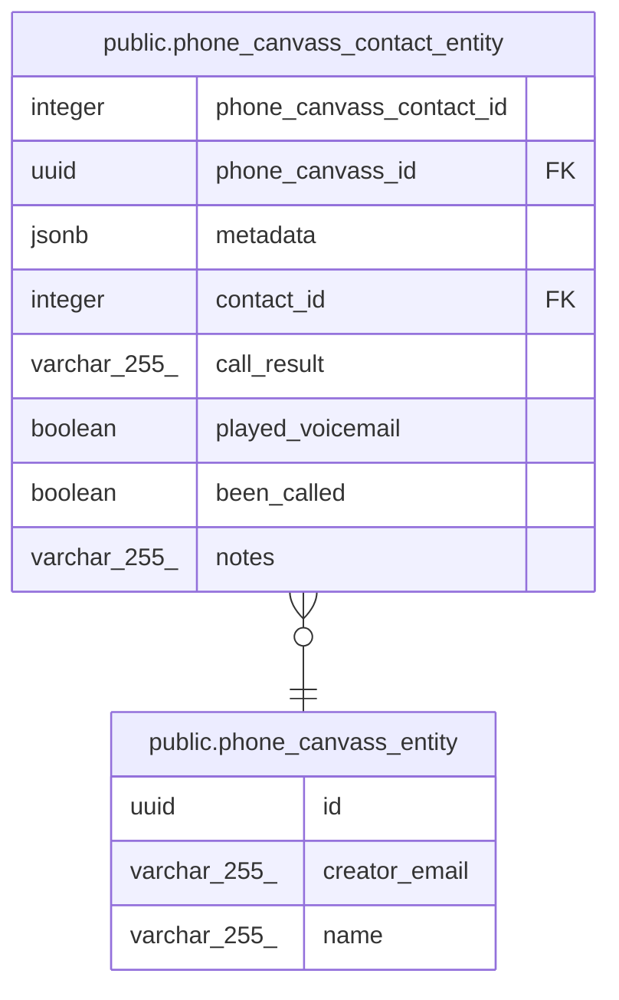

# public.phone_canvass_entity

## Description

## Columns

| Name          | Type         | Default           | Nullable | Children                                                                      | Parents | Comment |
| ------------- | ------------ | ----------------- | -------- | ----------------------------------------------------------------------------- | ------- | ------- |
| id            | uuid         | gen_random_uuid() | false    | [public.phone_canvass_contact_entity](public.phone_canvass_contact_entity.md) |         |         |
| creator_email | varchar(255) |                   | false    |                                                                               |         |         |
| name          | varchar(255) |                   | false    |                                                                               |         |         |

## Constraints

| Name                                        | Type        | Definition             |
| ------------------------------------------- | ----------- | ---------------------- |
| phone_canvass_entity_creator_email_not_null | n           | NOT NULL creator_email |
| phone_canvass_entity_id_not_null            | n           | NOT NULL id            |
| phone_canvass_entity_name_not_null          | n           | NOT NULL name          |
| phone_canvass_entity_pkey                   | PRIMARY KEY | PRIMARY KEY (id)       |

## Indexes

| Name                      | Definition                                                                                    |
| ------------------------- | --------------------------------------------------------------------------------------------- |
| phone_canvass_entity_pkey | CREATE UNIQUE INDEX phone_canvass_entity_pkey ON public.phone_canvass_entity USING btree (id) |

## Relations

---

> Generated by [tbls](https://github.com/k1LoW/tbls)
