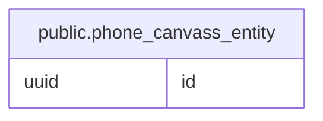

# public.phone_canvass_entity

## Description

## Columns

| Name | Type | Default           | Nullable | Children | Parents | Comment |
| ---- | ---- | ----------------- | -------- | -------- | ------- | ------- |
| id   | uuid | gen_random_uuid() | false    |          |         |         |

## Constraints

| Name                             | Type        | Definition       |
| -------------------------------- | ----------- | ---------------- |
| phone_canvass_entity_id_not_null | n           | NOT NULL id      |
| phone_canvass_entity_pkey        | PRIMARY KEY | PRIMARY KEY (id) |

## Indexes

| Name                      | Definition                                                                                    |
| ------------------------- | --------------------------------------------------------------------------------------------- |
| phone_canvass_entity_pkey | CREATE UNIQUE INDEX phone_canvass_entity_pkey ON public.phone_canvass_entity USING btree (id) |

## Relations

---

> Generated by [tbls](https://github.com/k1LoW/tbls)
