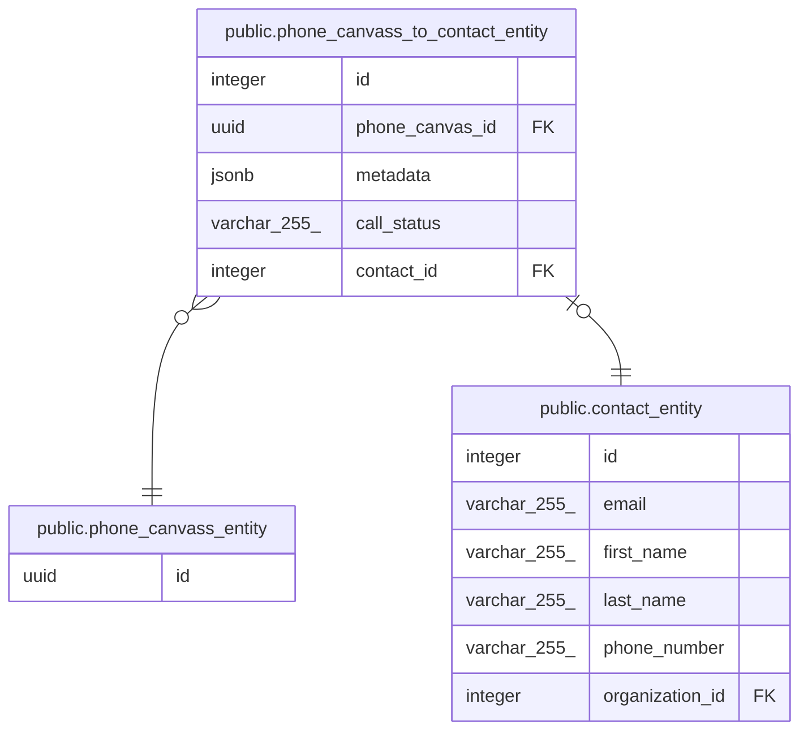

# public.phone_canvass_to_contact_entity

## Description

## Columns

| Name            | Type         | Default                                                     | Nullable | Children | Parents                                                       | Comment |
| --------------- | ------------ | ----------------------------------------------------------- | -------- | -------- | ------------------------------------------------------------- | ------- |
| id              | integer      | nextval('phone_canvass_to_contact_entity_id_seq'::regclass) | false    |          |                                                               |         |
| phone_canvas_id | uuid         |                                                             | false    |          | [public.phone_canvass_entity](public.phone_canvass_entity.md) |         |
| metadata        | jsonb        |                                                             | false    |          |                                                               |         |
| call_status     | varchar(255) |                                                             | false    |          |                                                               |         |
| contact_id      | integer      |                                                             | false    |          | [public.contact_entity](public.contact_entity.md)             |         |

## Constraints

| Name                                                    | Type        | Definition                                                                          |
| ------------------------------------------------------- | ----------- | ----------------------------------------------------------------------------------- |
| phone_canvass_to_contact_entity_contact_id_foreign      | FOREIGN KEY | FOREIGN KEY (contact_id) REFERENCES contact_entity(id) ON UPDATE CASCADE            |
| phone_canvass_to_contact_entity_phone_canvas_id_foreign | FOREIGN KEY | FOREIGN KEY (phone_canvas_id) REFERENCES phone_canvass_entity(id) ON UPDATE CASCADE |
| phone_canvass_to_contact_entity_pkey                    | PRIMARY KEY | PRIMARY KEY (id)                                                                    |
| phone_canvass_to_contact_entity_contact_id_unique       | UNIQUE      | UNIQUE (contact_id)                                                                 |

## Indexes

| Name                                              | Definition                                                                                                                               |
| ------------------------------------------------- | ---------------------------------------------------------------------------------------------------------------------------------------- |
| phone_canvass_to_contact_entity_pkey              | CREATE UNIQUE INDEX phone_canvass_to_contact_entity_pkey ON public.phone_canvass_to_contact_entity USING btree (id)                      |
| phone_canvass_to_contact_entity_contact_id_unique | CREATE UNIQUE INDEX phone_canvass_to_contact_entity_contact_id_unique ON public.phone_canvass_to_contact_entity USING btree (contact_id) |

## Relations

---

> Generated by [tbls](https://github.com/k1LoW/tbls)
