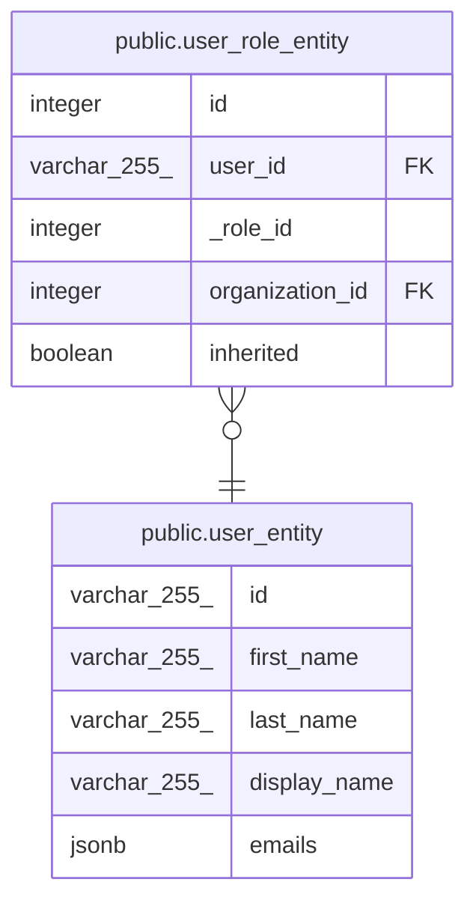

# public.user_entity

## Description

## Columns

| Name         | Type         | Default | Nullable | Children                                              | Parents | Comment |
| ------------ | ------------ | ------- | -------- | ----------------------------------------------------- | ------- | ------- |
| id           | varchar(255) |         | false    | [public.user_role_entity](public.user_role_entity.md) |         |         |
| first_name   | varchar(255) |         | true     |                                                       |         |         |
| last_name    | varchar(255) |         | true     |                                                       |         |         |
| display_name | varchar(255) |         | true     |                                                       |         |         |
| emails       | jsonb        |         | true     |                                                       |         |         |

## Constraints

| Name                       | Type        | Definition       |
| -------------------------- | ----------- | ---------------- |
| user_entity_email_not_null | n           | NOT NULL id      |
| user_entity_pkey           | PRIMARY KEY | PRIMARY KEY (id) |

## Indexes

| Name             | Definition                                                                  |
| ---------------- | --------------------------------------------------------------------------- |
| user_entity_pkey | CREATE UNIQUE INDEX user_entity_pkey ON public.user_entity USING btree (id) |

## Relations

---

> Generated by [tbls](https://github.com/k1LoW/tbls)
