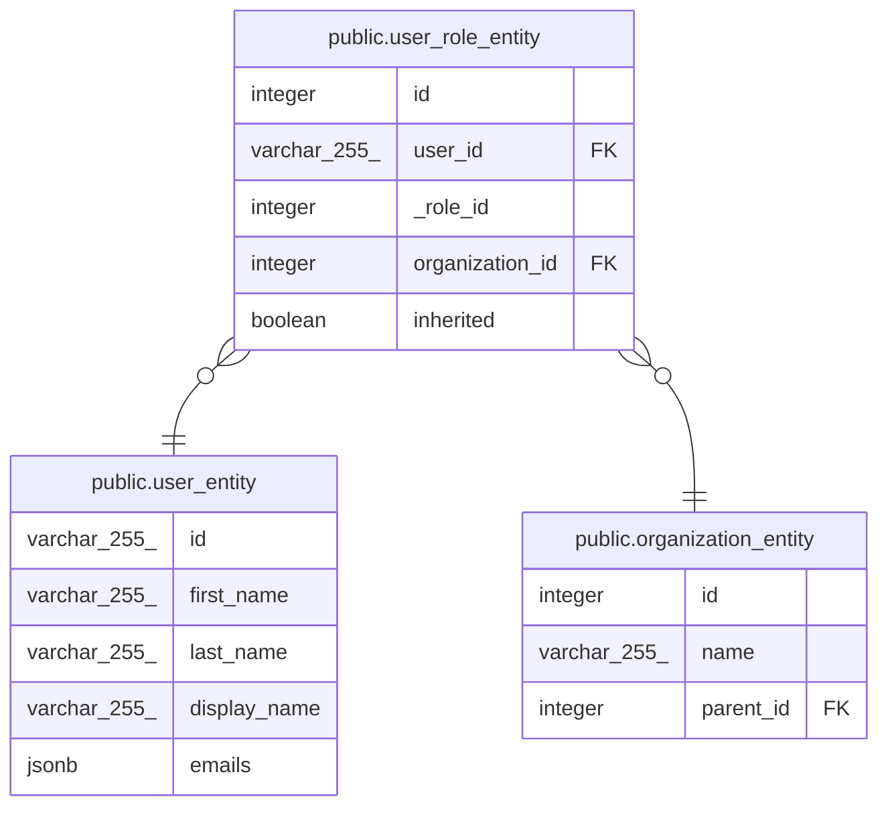

# public.user_role_entity

## Description

## Columns

| Name            | Type         | Default                                      | Nullable | Children | Parents                                                     | Comment |
| --------------- | ------------ | -------------------------------------------- | -------- | -------- | ----------------------------------------------------------- | ------- |
| id              | integer      | nextval('user_role_entity_id_seq'::regclass) | false    |          |                                                             |         |
| user_id         | varchar(255) |                                              | false    |          | [public.user_entity](public.user_entity.md)                 |         |
| \_role_id       | integer      |                                              | false    |          |                                                             |         |
| organization_id | integer      |                                              | false    |          | [public.organization_entity](public.organization_entity.md) |         |
| inherited       | boolean      |                                              | false    |          |                                                             |         |

## Constraints

| Name                                     | Type        | Definition                                                                         |
| ---------------------------------------- | ----------- | ---------------------------------------------------------------------------------- |
| user_role_entity_user_id_foreign         | FOREIGN KEY | FOREIGN KEY (user_id) REFERENCES user_entity(id) ON UPDATE CASCADE                 |
| user_role_entity_organization_id_foreign | FOREIGN KEY | FOREIGN KEY (organization_id) REFERENCES organization_entity(id) ON UPDATE CASCADE |
| user_role_entity_pkey                    | PRIMARY KEY | PRIMARY KEY (id)                                                                   |

## Indexes

| Name                  | Definition                                                                            |
| --------------------- | ------------------------------------------------------------------------------------- |
| user_role_entity_pkey | CREATE UNIQUE INDEX user_role_entity_pkey ON public.user_role_entity USING btree (id) |

## Relations

---

> Generated by [tbls](https://github.com/k1LoW/tbls)
