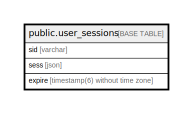

# public.user_sessions

## Description

## Columns

| Name   | Type                           | Default | Nullable | Children | Parents | Comment |
| ------ | ------------------------------ | ------- | -------- | -------- | ------- | ------- |
| sid    | varchar                        |         | false    |          |         |         |
| sess   | json                           |         | false    |          |         |         |
| expire | timestamp(6) without time zone |         | false    |          |         |         |

## Constraints

| Name         | Type        | Definition        |
| ------------ | ----------- | ----------------- |
| session_pkey | PRIMARY KEY | PRIMARY KEY (sid) |

## Indexes

| Name               | Definition                                                                     |
| ------------------ | ------------------------------------------------------------------------------ |
| session_pkey       | CREATE UNIQUE INDEX session_pkey ON public.user_sessions USING btree (sid)     |
| IDX_session_expire | CREATE INDEX "IDX_session_expire" ON public.user_sessions USING btree (expire) |

## Relations

---

> Generated by [tbls](https://github.com/k1LoW/tbls)
